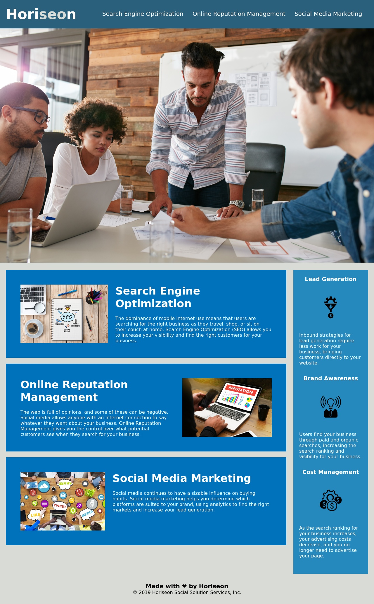

# Horiseon Home - Application Description

This application opens up the Horiseon homepage. It has a functional and friendly UI that navigates to sections of the page itself via the navigation bar at the top. The source code uses semantic elements to match accessibility standards. elements in the HTML and CSS code follow a logical structure and CSS codes are organized and commented. All images and icons have proper alt descriptions for accessibility purposes.

## What I Did

In this assignment:
* Non-semantic tags were adjusted to read semantically, while making sure that the web page will still run as intended. 
* Comments were added to the code to note where those changes have been made. 
* Classes were also changed to read semantically, and the CSS code was updated to match the classes and tags that were changed in the HTML code. 
* Comments were also added to the CSS code to describe which sections will format what portions of the web page, for reference.
* The title of the page was changed to be more descriptive.

## Home Page

### Link to Application

(https://bslindsa.github.io/blindsay-horiseon-css-site/#social-media-marketing)

© 2021 Trilogy Education Services, LLC, a 2U, Inc. brand. Confidential and Proprietary. All Rights Reserved.
